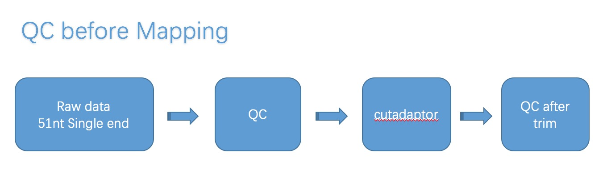
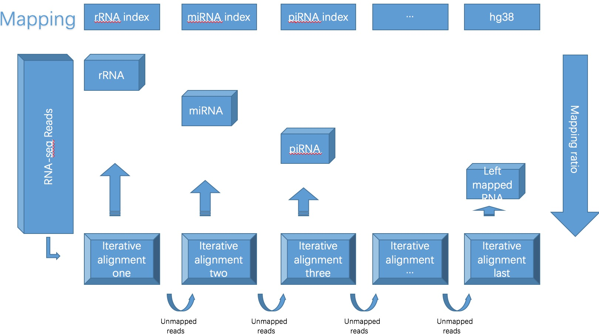
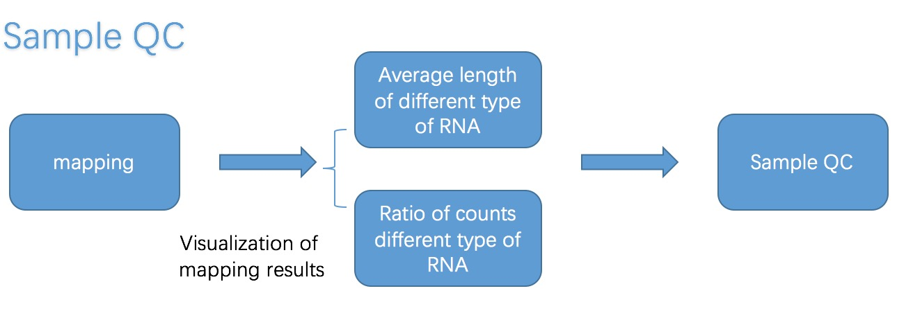

# Mapping, Annotation and QC

## 1\) Pipeline








## 2\) Data Structure

```text
~/proj_exRNA/
|-- RNA_index      #3d)中比对到各种RNA类型的index
|-- hg38_index     #3d)中最后一步所需要的index
|-- raw_data
|-- output         #可以根据自己的习惯对output进行整理，以下是按照流程设置output的路径
eg: |-- QC1        #对应3b)step one
    |-- trim       #对应3b)step two
    |-- QC2        #对应3b)step three
    |-- map        #对应3c)3d)
        |-- 1.no_rRNA
            |-- fastq    #存*.no_rRNA.fq，详见3c)
            |-- sam      #存*.<rRNA>.sam，详见3c)
        |-- 2.no_miRNA   #与上类似
        |-- ...
```

**Inputs**

| **File format** | **Information contained in file** | **File description** |
| :--- | :--- | :--- |
| fastq | **reads** | five samples, GEO link: GSE71008 |

**Outputs**

| **File format** | **Information contained in file** |
| :--- | :--- |
| sam/bam | mapped reads to different kinds of indexes |
| picture format | visualization of mapping results |

## 3\) Running Steps

### Example of single case

#### **3a\) 获取数据**

从`/BioII/chenxupeng/student`上获取基因组数据`hg38`，基因组注释数据`/gtf`，索引文件`/transcriptome_rsem_bowtie2`以及原始数据`(fastq files)`到自己的账号下

| data | path |
| :--- | :--- |
| `hg38` | `/BioII/chenxupeng/student/hg38_index/GRCh38.p10.genome.fa` |
| `gtf` | `/BioII/lulab_b/shared/genomes/human_hg38/anno/gtf` |
| `RNA index` | `/BioII/chenxupeng/student/RNA_index/` |
| `raw data` | `/BioII/chenxupeng/student/raw_data/*.fastq` |

推荐使用`ln`命令

#### **3b\) QC** **- Trim - QC**

这步操作目的主要有两个，一个是检查数据的质量，另一个是减掉接头序列

* **Step one - QC of raw data**

**Input:**

| data type | path |
| :--- | :--- |
| `raw data` | `/BioII/chenxupeng/student/raw_data/*.fastq` |

**Software/Parameters:**

`fastqc`

| `options` | function |
| :--- | :--- |
| `-q --quiet` | Supress all progress messages on stdout and only report errors. |
| `-o --outdir` | Create all output files in the specified output directory. |
| `-h --help` | detailed introduction of options |

**Output:**

QC files


* **step two - cut adaptor & trim long read**

**Input:**

| data type | **path** |
| :--- | :--- |
| `raw data` | `/BioII/chenxupeng/student/raw_data/*.fastq` |

**Software/Parameters:**

`cutadapt`: cutadapt removes adapter sequences from high-throughput sequencing reads.

Usage: `cutadapt -a ADAPTER [options] [-o output.fastq] input.fastq`

| `options with Parameter Setting` | function |
| :--- | :--- |
| `-u -100` | remove last 100nt so that the first 50nt is kept |
| `-q 30,30` | read quality need to be above 30 |
| `-m 15` | reads less than 15nt are removed |
| `-a AGATCGGAAGAGCACACGTCTGAACTCCAGTCAC` | cut adapt |
| `--trim-n` | trim N's on ends of reads. |

**Output:**

`*.fastq.trim`


* **step three - QC after Trim**

除了输入文件是trim后的数据以外，过程与step one相同


#### **3c\)** Clean rRNA reads 

bowtie2可以将`.fastq`文件比对到rRNA index上从而得到**不含rRNA reads的`.fastq`文件以及map到rRNA index上的`.sam`文件**

**Input:**

3b\)操作结束后的`*.fastq.trim`

**Software/Parameters:** 

bowtie2可以Clean rRNA reads得到不含rRNA reads的`.fastq`文件以及map到rRNA index上的`.sam`文件

```text
bowtie2 -p 4 [options] -x <bt2-idx> --un <address of unmapped reads> $input_file [-S <sam>]
```

| `options with Parameter Setting` | function |
| :--- | :--- |
| `--sensitive-local(default)` | allow no mismatch, etc |
| `--norc` | do not align reverse-complement version of read |
| `--no-unal` | suppress SAM records for unaligned reads |
| `--un` _`<path to unmapped reads>`_ | store unmapped reads |
| **`-x`** _**`<path to index>/rRNA`**_ | indexed genome/transcriptome |
| `-S` _`<path to output file>`_ | output file foramt as sam |

对于那些map到rRNA index上的`.sam`文件，可以用samtools的view功能转化为`.bam`文件，具体可以敲入`samtools view -h`查看怎么转化

**Output:**

不含rRNA reads的`.fastq`文件`*.no_rRNA.fq`

map到rRNA index上的`*.<rRNA>.sam`文件


#### 3d\) Mapping

这步的目的就是得到比对到各种RNA类型（例如miRNA, piRNA, Y RNA和srp RNA等等）的index后得到的`.sam`文件，mapping的过程就类似于clean rRNA reads的过程。

只不过，3c\) 比对的index是rRNA，这里只需要 1）**把index替换成其他类型的index**，2）**将上一步比对得到的`*.no_<some type of RNA>.fq`作为input**，重复1）2），直至比对完所有类型至这样就可以得到各种RNA类型的比对结果。

**Input:**

`*.no_<some type of RNA>.fastq`

**Software/Parameters:**

类似3c\)，只需修改index和input：

```text
bowtie2 -p 4 [options] -x <bt2-idx> --un <address of unmapped reads> $input_file [-S <sam>]
```

| `Parameter Setting` |
| :--- |
| **`-x`** _**`<path to index>/`**_**`<some type of RNA>`** |
| **`*.<RNA --un by the previous step>.fq`**   as `$input_file` |
| **`-un`**_**`<path to output>/`**_**`*.no_<some type of RNA>.fq`** |
| `-S` _**`<path to .sam file>/`**_**`<some type of RNA>.sam`** |

对于那些map到rRNA index上的`.sam`文件，可以用samtools的view功能转化为`.bam`文件，具体可以敲入`samtools view -h`查看怎么转化

**Output:**

不含某类型RNA reads的`.fastq`文件**`*.no_<some type of RNA>.fq`**

map到某类型RNA index上的`*.<some type of RNA>.sam`文件

**Repeat:**

index文件夹下，有各种类型RNA的index，我们所要做的，就是把reads依次map到各种类型的RNA index上，推荐次序为，miRNA、piRNA、Y\_RNA、srpRNA、tRNA、snRNA、snoRNA、lncRNA、mRNA、tucp最后是hg38other（此步index为`hg38`不在RNA\_index文件夹下需要注意）。

\*\*\*\*

#### 3e\) Sample QC

原始数据经过3c\) 3d\)各种map之后，为了可视化结果，可以做以下的操作：

* 统计不同RNA类型mapped reads的长度并以直方图展示
* 统计不同RNA类型reads的比例并以饼图展示

为了让比对结果更让人信服，我们基于不同RNA类型reads的比例制定了一套标准：

| **Check point** | **Threshold** | **Notes** |
| :--- | :--- | :--- |
| Raw reads quality | reads quality &gt;28 \(median lines in green area\) | Check fastqc results\(\*.html\) |
| Clean reads number | **&gt; 10 million** | Adaptors and too-short sequences removed reads |
| rRNAs% | **&lt; 10%** | Reads mapped to rRNAs \(all following % are divided by the **total number of clean reads**\) |
| HG% | &gt; 60% \(optional\) | Reads mapped to Human Genome **except rRNAs** |
| Transcriptome% | **&gt; 50%** | Reads mapped to Human **Transcriptome** \(including rRNA, miRNA, piRNA, Y RNA, srpRNA, snRNA, snoRNA, tRNA, mRNA exons, lncRNA exons, TUCP exons\) |
| Y RNA% | **10%~65%** | Reads mapped to Y RNA |
| miRNA% | **10%~65% \(**up to 80% for exoRNAs**\)** | Reads mapped to miRNA |


### Tips/Utilities


