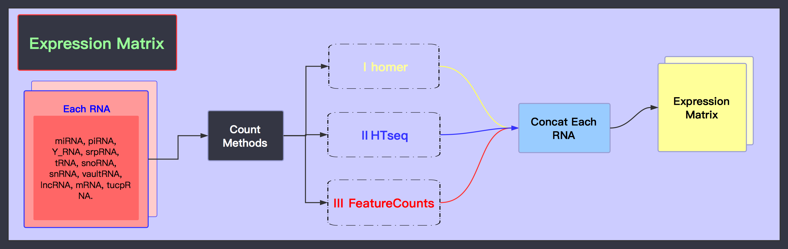

# Expression Matrix

## Pipeline



## Data Structure


### inputs

| **File format** | **Information contained in file** | **File description** | **Notes** |
| :--- | :--- | :--- | :--- |
| bam | **alignments** | Produced by mapping reads to the transcriptome. | Reads are trimmed using a proprietary version of cutAdapt. We map to transcriptome for a better sensitivity \(see details in protocol and example\). |

### outputs

| **File format** | **Information contained in file** | **File description** | **Notes** |
| :--- | :--- | :--- | :--- |
| bigWig | **signal** | Normalized RNA-seq signal | Signals are generated for transcriptome both the plus and minus strands and for unique reads and unique+multimapping reads. |
| tsv | **gene \(ncRNA\) quantifications** | Non-normalized counts. |  |

## Running Scripts

### Software/Tools

* RSEM
* FeatureCounts

### Example of single case

#### 0\) Convert & View

在上一章节Mapping, Annotation and QC中，我们得到比对到各种类型的RNA的index上的`.sam`文件

* step one

现在我们将其中的`*.miRNA.sam`文件从RNA上的相对位置转换到genomic coordinates

**Input:**

| 属性 | 文件 |
| :--- | :--- |
| reference\_name | `<path-to-miRNA-index>/miRNA` |
| unsorted\_transcript\_bam\_input | `*.miRNA.sam` |

**Software usage：**

```text
rsem-tbam2gbam reference_name unsorted_transcript_bam_input genome_bam_output
```

**Output:**

| 类型 | 文件 |
| :--- | :--- |
| genome\_bam\_output | `*.miRNA.rsem.bam` |


* step two

将`.bam`文件转化为`.bedGraph/.bigwig`

**Input1:**

`.bam`

**Software usage:**

`.bam`文件排序：`samtools sort`

**Output1/Input2:**

`.sorted.bam`

**Software usage:**

建立bam索引：`samtools index`

**Output2:**

`.bai`

**Software usage:**

`bedtools genomecov`可以帮助创建`.bedGraph`文件，sort可得到`.sorted.bedGraph`

| options | function |
| :--- | :--- |
| `-ibam` | The input file is in BAM format. |
| `-bga` | Report depth in BedGraph format. |
| `-split` | Treat "split" BAM or BED12 entries as distinct BED intervals. |

**Output3/Input4：**

`.sorted.bedGraph`

**Software usage:**

`bedGraphToBigWig`将`.sorted.bedGraph`转化为`.sorted.bw`

Usage: `bedGraphToBigWig in.bedGraph chrom.sizes out.bw`

chrom.sizes: `/BioII/lulab_b/shared/genomes/human_hg38/sequence/hg38.chrom.sizes`

**Output5:**

`.sorted.bw`


可视化

**Input1:**

`*.sorted.bam`

**Software usage:**

```text
# create tag directories
makeTagDirectory *.tagsDir/ *.sorted.bam
```

**Output1/Input2:**

`*.tagsDir/`

**Software usage:**

```text
# make bedGraph visualization files
makeUCSCfile *.tagsDir/ -fragLength given -o auto
```

#### 

#### 1\) FeatureCounts

**Input:**

| 类型 | 文件 |
| :--- | :--- |
| `input_file` | `*.sorted.bam` |
| `annotation file` | `/BioII/lulab_b/shared/genomes/human_hg38/gtf/gencode.v27.annotation.gff3` |

**Software usage:**

Usage:

```text
featureCounts -a <annotation_file> -o <output_file> input_file
```

| options | function |
| :--- | :--- |
| `-a` | Name of an annotation file. |
| `-o` | Name of the output file including read counts. |
| `input_file` | A list of SAM or BAM format files. |

```text
featureCounts -a /BioII/lulab_b/shared/genomes/human_hg38/gtf/gencode.v27.annotation.gff3 -o NC_1.hg38.featureCounts.counts NC_1.hg38.sorted.bam
```

**Output:**

`*.featureCounts.counts`

####    

